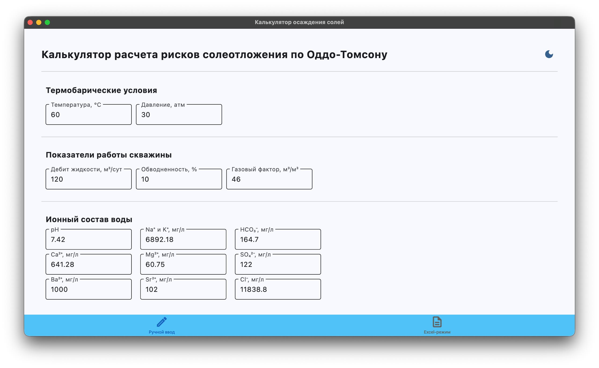
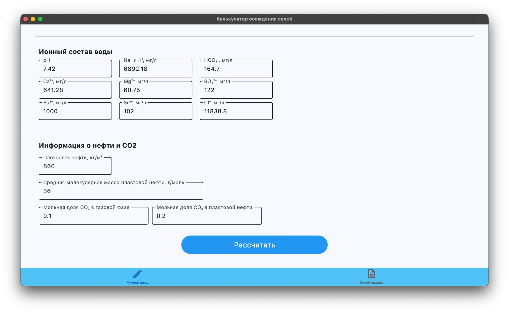
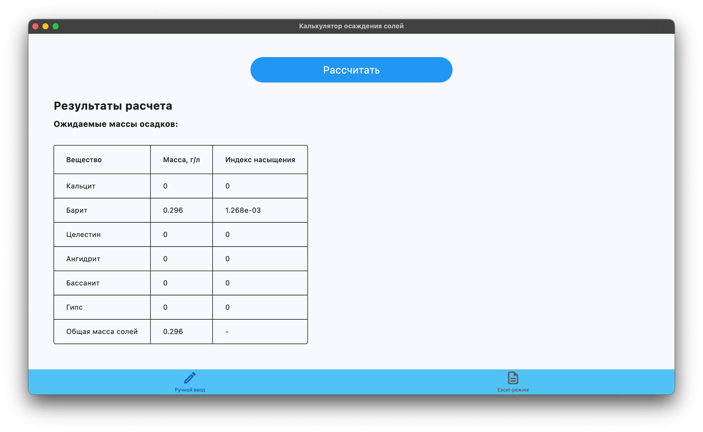
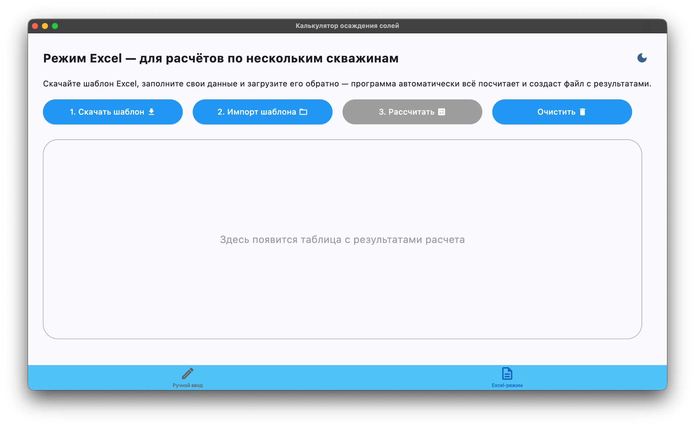
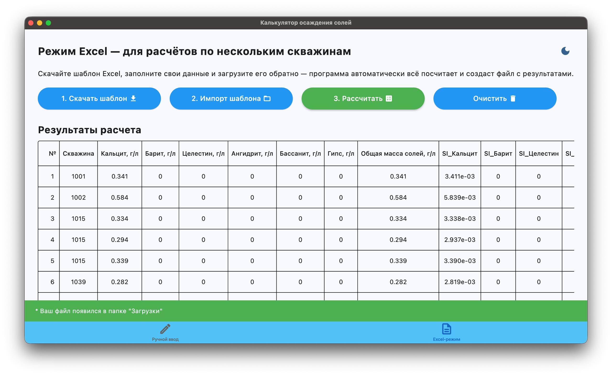

# Калькулятор расчета рисков солеотложения по Оддо-Томсону

[](https://www.python.org/)
[](https://flet.dev/)
[](LICENSE)

Приложение для расчета рисков отложения неорганических солей (кальцит, барит, целестин, ангидрит, бассанит, гипс) в нефтяных скважинах по методике Оддо-Томсона.

## 📋 Описание

Расчет производится с учетом термобарических условий, ионного состава воды и параметров работы скважины.

### Границы применимости

| Параметр | Диапазон |
|----------|----------|
| Температура | 0 – 175 °C |
| Давление | 1 – 950 атм |
| Минерализация воды | 0 – 300 г/л |

## 📸 Использование











### Входные данные

**Обязательные параметры:**
- Температура (°C)
- Давление (атм)

**Ионный состав воды (мг/л):**
- Cl⁻, SO₄²⁻, HCO₃⁻, Ca²⁺, Mg²⁺, Na⁺+K⁺, Ba²⁺, Sr²⁺

**Опционально:**
- Дебит жидкости (м³/сут), обводненность (%), газовый фактор (м³/м³)
- Плотность и молекулярная масса нефти
- Мольная доля CO₂ в газе и нефти

### Результаты

Приложение рассчитывает максимальную массу осадков (г/л) для каждой соли и общую массу солей.

**Индекс насыщения (SI):**
- SI > 0: пересыщен, возможен осадок
- SI = 0: равновесие
- SI < 0: недонасыщен, осадок не выпадает

## 🚀 Установка и запуск

```bash
pip install -r requirements.txt
python app.py
```

## 📁 Структура проекта

```
/workspace/
├── app.py              # Основной файл приложения
├── README.md           # Документация
├── Screenshots/        # Скриншоты интерфейса
└── Docs/               # Методика, шаблоны, примеры
```

## 📚 Источники

- Методика расчета по Оддо-Томсону (см. `Docs/`)
- Oddo J.E., Tomson M.B. "Simple Calculation Model for Predicting Scale Formation in Oil and Gas Wells"

## 📌 Лицензия

MIT License © Uralbeckins Corporation
All Rights Reserved
